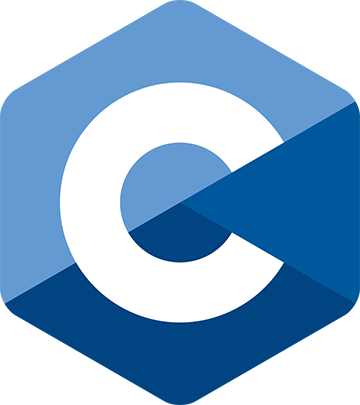
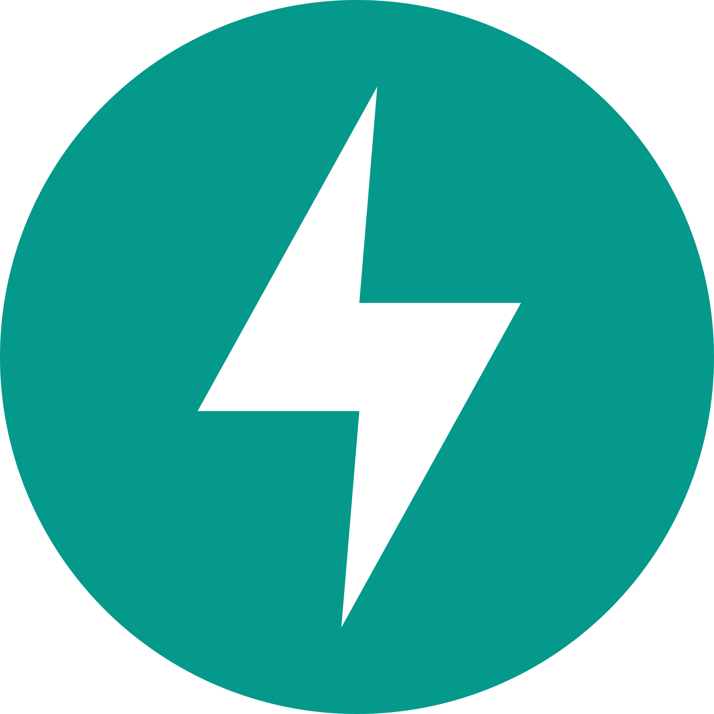
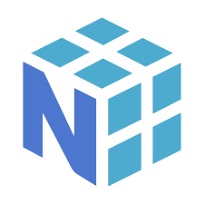

# Hi! I'm Sudhan ✌️

### I am a CS Junior.  📓

### I'm passionate about building deep learning models from scratch and exploring their diverse applications, with a focus on backend development. ⛄

 

## Technologies/Languages 📑

 

 

## Recent Open-Source Personal projects : 🚀

- [Mini-GPT](https://github.com/Sudhan-Dahake/Mini-GPT)
- [Name Synthesizer](https://github.com/Sudhan-Dahake/WaveNet-NameSynth)
- [Swapify](https://github.com/Sudhan-Dahake/Swapify)

 

## Hackathons 🏆

- _Participant_ - Hack The North 2024: "[LossEndFound](https://github.com/Sudhan-Dahake/LossEndFound)"

 

## Other Interests 🌠

- Deep Learning Researcher 👨‍💻
- Horror Movies 👹
- Reading Books 📔

 

## Socials 📫

- [LinkedIn](https://www.linkedin.com/in/sudhandahake/)